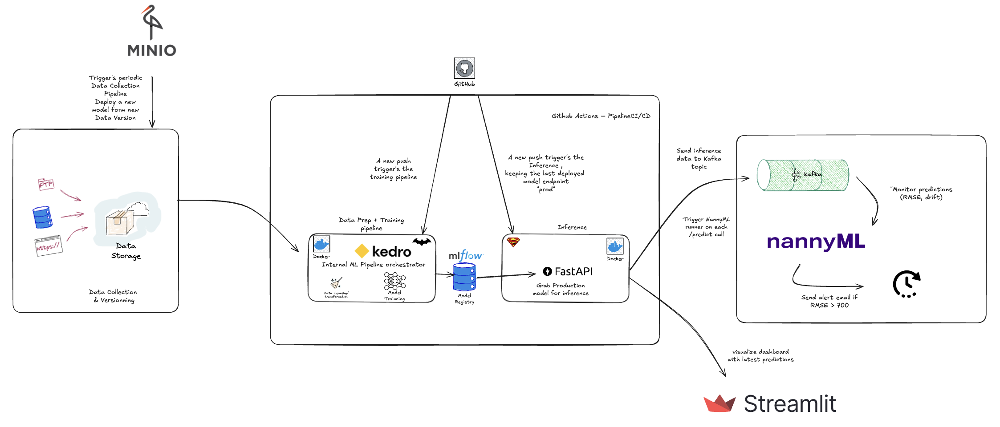

# ⚡ Superman – Inference API for Energy Forecasting

This project exposes a FastAPI endpoint that loads models from MLflow, processes energy consumption features, applies a scaler, and predicts values using an XGBoost model. It supports inference over a time period (`T1`, `T2`), and pushes results to Kafka for monitoring (e.g., via NannyML).

---

## 🛠️ Tech Stack

- [FastAPI](https://fastapi.tiangolo.com/)
- [MLflow](https://mlflow.org/)
- [Kafka](https://kafka.apache.org/)
- Docker (for deployment)

---

## 🚀 Usage

### 1. Create & configure `.env`

```env
MLFLOW_TRACKING_URI=....
MODEL_NAME=EnergyForecastModel_xgboost
SCALER_NAME=Scaler_standard
MODEL_STAGE=prod
AWS_ACCESS_KEY_ID=mlflow
AWS_SECRET_ACCESS_KEY=****
MLFLOW_S3_ENDPOINT_URL=....
KAFKA_BOOTSTRAP_SERVERS=....
KAFKA_TOPIC=energy_forecast
```

### 2. Install requirements

```bash
python -m venv venv
source venv/bin/activate  # or .\venv\Scripts\activate on Windows
pip install -r requirements.txt
```

### 3. Run the API

```bash
uvicorn app.main:app --reload
```

Access documentation at [http://localhost:8000/docs](http://localhost:8000/docs)

---

## 🧪 Testing

```bash
pytest tests/
```

---

## 📤 Example Request

POST `/predict`

```json
{
  "T1": "2025-06-01",
  "T2": "2025-06-05"
}
```

Response:

```json
{
  "prediction": [1234.5, 1200.2, ...]
}
```

---

## 🔌 Kafka Integration

Predictions are sent to the Kafka topic `inference_topic`. You can listen to this topic to track predictions in real time.

---

## 📦 Docker

```bash
docker build -t superman-inference .
docker run --env-file .env -p 8000:8000 superman-inference
```

Or use Docker Compose:

```bash
docker-compose up --build
```

---

## 📁 Project Structure

```
Superman/
├── app/
│   ├── main.py             # FastAPI app
│   ├── model.py            # MLflow model loading
│   ├── schemas.py          # Pydantic input/output models
│   └── utils.py            # Preprocessing, scaling, Kafka
├── core/
│   ├── data_preprocessing.py  # Raw data handling & transformation
│   └── features_engineering.py # Feature generation
├── tests/
│   └── test_api.py
├── .env
├── .gitignore
├── Dockerfile
├── docker-compose.yml
├── requirements.txt
└── README.md
```


---

## 📎 Notes

* Make sure the models (`Scaler_standard` and `EnergyForecastModel_xgboost`) are correctly logged under the alias `prod`.
* The inference will fail if you provide a date range that is too large (e.g. > 7 days).
* The tempo dataset URL is dynamically generated using the year of `T2`.
* The API will download and process the relevant data automatically based on your input.
